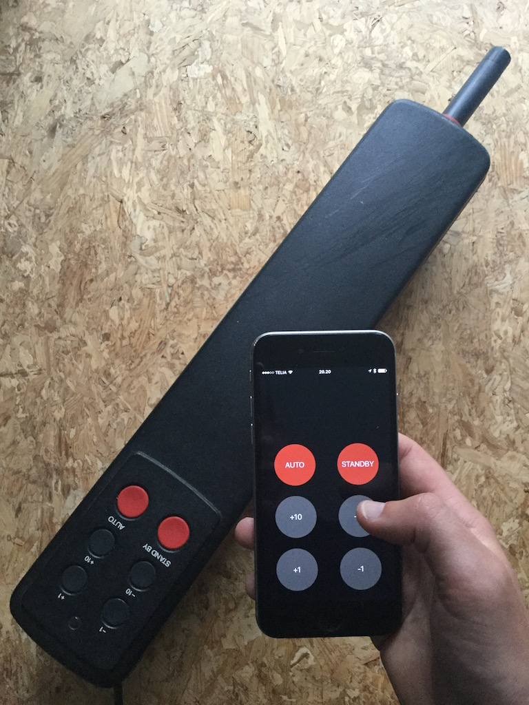
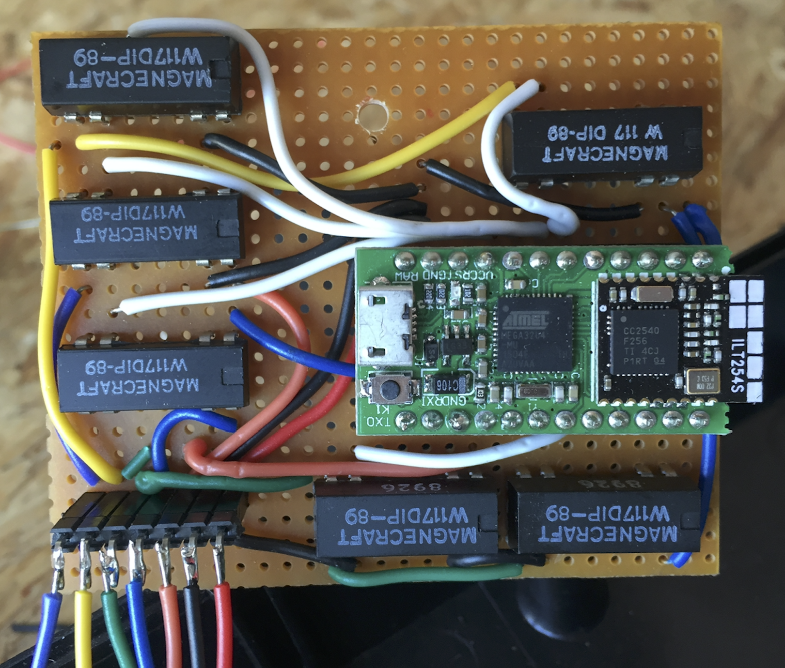
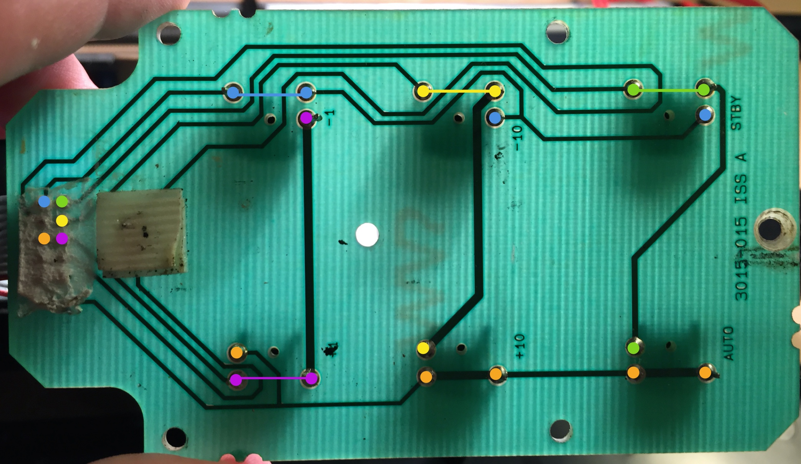
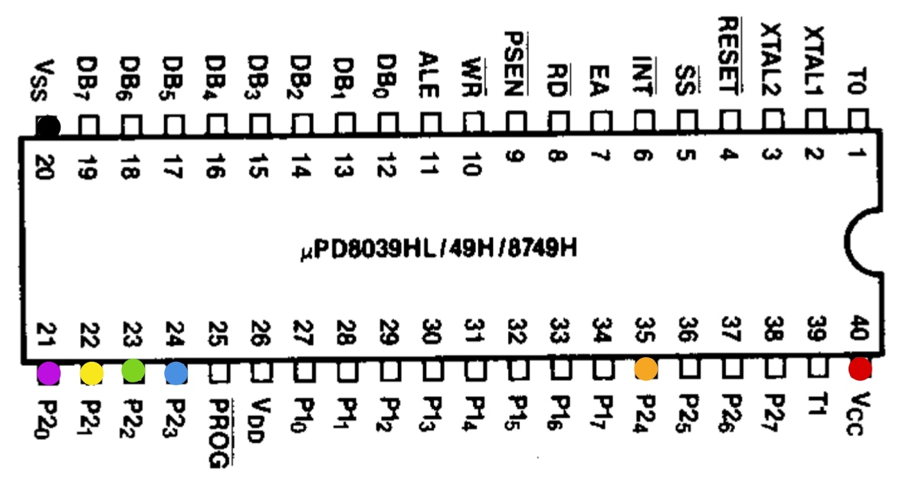
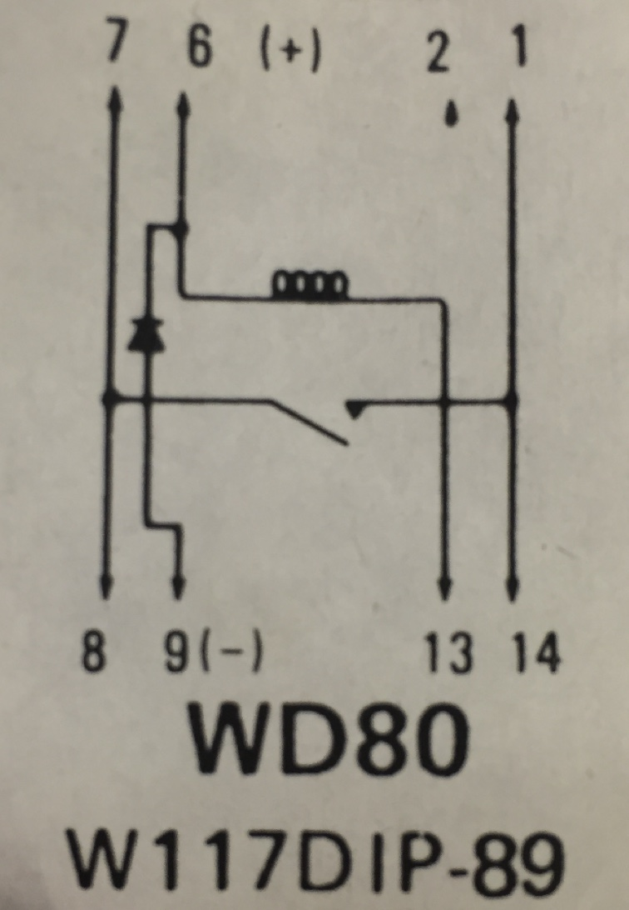
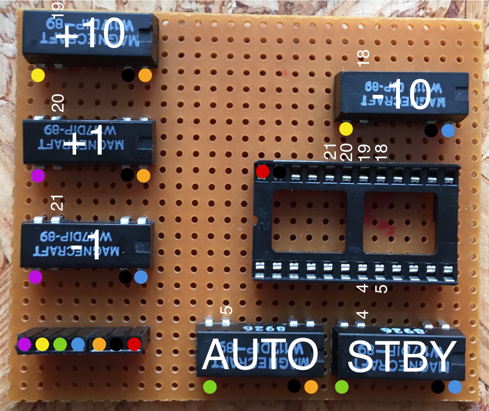
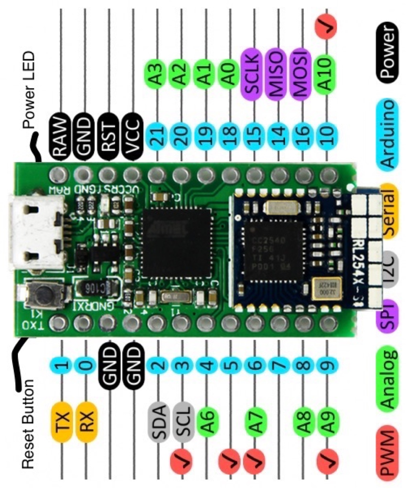

# iOS remote for Autohelm 800

This is a hobby project on how to make an iOS remote control for the Autohelm 800 autopilot.

[Video of the app in action](https://vimeo.com/175227393)

## Electronics

My initial idea was to use the remote control port that is located underneath the Autohelm 800, but I had no luck decoding the protocol used. I tried both listening for Serial and I2C, but I suspect that it is some proprietary communication protocol by Raymarine, and of course there is no documentation on this.

So instead I went for the other obvious (and less elegant) solution - simulating button presses with relays.

Below is a picture of the final board. Luckily there is quite a lot of space beside the main pcb in the Autohelm, and it even has an unused screw hole for mounting.

### Bill of materials
- 1 x [Blueduino Rev2](https://www.tindie.com/products/AprilBrother/blueduino-rev2-arduino-compatible-plus-ble/)
- 5 x Reed Relay W117DIP-89

### Diagrams and wiring

There is five wires coming from the button panel PCB, and I colour coded these wires with Blue, Green, Yellow, Purple, and Orange as seen below

So shorting the following wires would create the following button presses
- Blue + Purple = -1
- Orange + Purple = +1
- Yellow + Blue = -10
- Yellow + Orange = +10
- Green + Blue = Standby
- Green + Orange = Auto

Instead of soldering wires onto the button panel PCB, I found it easier to solder onto the main PCB mounted in the bottom part of the autopilot since this gives much shorter cable lengths and the cables are not in the way when you open the autopilot. So I mapped out where the 5 wires are connected on main Micro Controller on the main PCB below

I soldered the 5 wires onto the back of the main PCB. In addition I soldered a power (5V) and Ground cable on to pin 40 and pin 20, so I could power the Blueduino and the relays.

The reed relays that I found has the following diagram.

So again following the colour codes I made the following pcb layout.

For reference I included the Blueduino Rev2 pin diagram below.

## Blueduino

The blueduino combines Arduino with a CC2540 BLE module.

Note that you have to choose "LilyPad USB" to download the sketch to the board.

More documentation can be found here
* https://www.tindie.com/products/AprilBrother/blueduino-rev2-arduino-compatible-plus-ble/
* http://wiki.aprbrother.com/wiki/BlueDuino_rev2

I used the Arduino IDE 1.6.5 for the project (not that it should matter which version you use).

## iOS app

I wanted to learn a bit of Swift so the example code from Blueduino site was not very helpful to me.

Instead I based the code largely on [this example](https://www.raywenderlich.com/85900/arduino-tutorial-integrating-bluetooth-le-ios-swift) from Ray Wenderlich.
